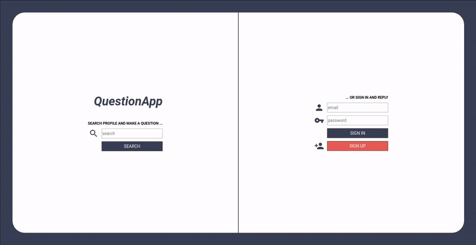
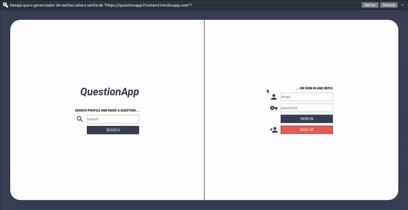
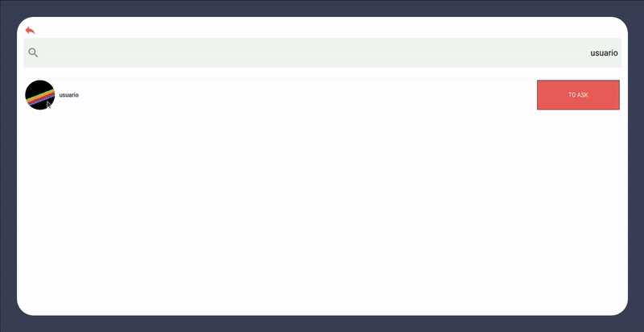

# QuestionApp

Aplicação baseada no site Ask.fm, onde qualquer faz perguntas anônimas aos usuários cadastrados e esses usuários respondem essas perguntas.

Desenvolvida com intuito de estudo e aplicação de tecnologias.

Aplicação disponivel em: https://questionapp-frontend.herokuapp.com

## Tecnologias do Front-end

- Typescript
- ReactJS;
- React Hooks;
- Axios;
- Styled Components;
- React Context;
- React Toastify;
- React Icons;
- Yup;

# Screenshots

## Cadastro usuário

## Fazendo perguntas ao usuário

## Respondendo às perguntas

## Listando respostas respondidas pelo usuário

# Executando aplicação

## `git clone`

Execute o clone da aplicação a partir do repositório: https://github.com/eniofilipe/project-question-frontend.git

## `yarn`

Execute o comando 'yarn' no diretório da aplicação para que seja instalado as respectivas dependências.

## `yarn start`

Executa a aplicação em modo 'development' (desenvolvimento).
Acesse [http://localhost:3000](http://localhost:3000).
